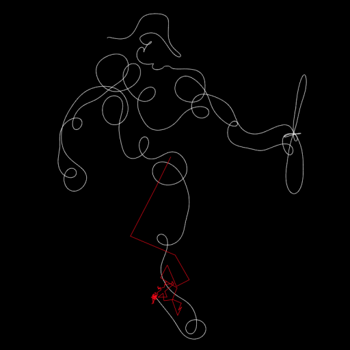
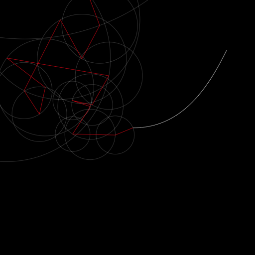
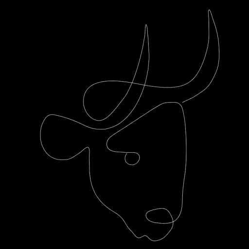
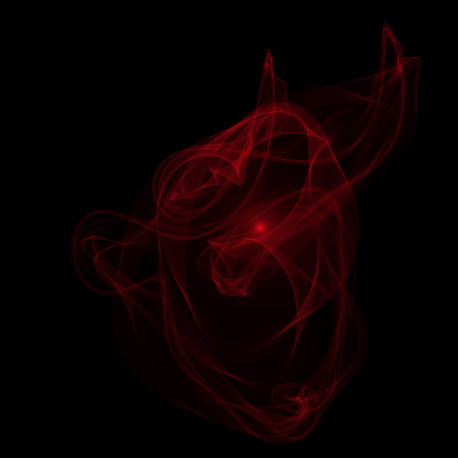
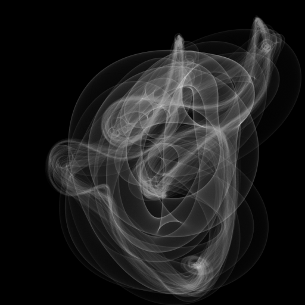

# picasso-fourier

## Description
The Fourier Transform is a mathematical process that breaks a complex signal into a sum of sines and cosines, which can be represented as rotating circles. The more circles are used, the more precise the approximation is.

This project uses this tool to analyze some of Picasso's single line drawings. I picked sketches mostly from his iconic animals series, as well as his take on the traditional Arlequin character.

You can try to be your own Picasso by drawing on the canvas.

See it live [here](https://piellardj.github.io/picasso-fourier/).

## Details

The curve is decomposed as a sum of segments, each being of fixed length and rotating at a fixed speed. The length and rotation speed of each segment is described by the computed Fourier coefficients.

*Illustration of the construction process: construction segments (red), rotation of the segments (white circles) and resulting curve (white)*

The whole computation is performed on the CPU:
* Fourier coefficients, performed once at the loading of the curve points
* points along the approximated curve, performed lazily during the simulation

Not clearing the canvas between each iteration results in cool effects:

*Base curve*

*Persistent mode with the construction segments displayed*

*Persistent mode with the construction circles displayed*